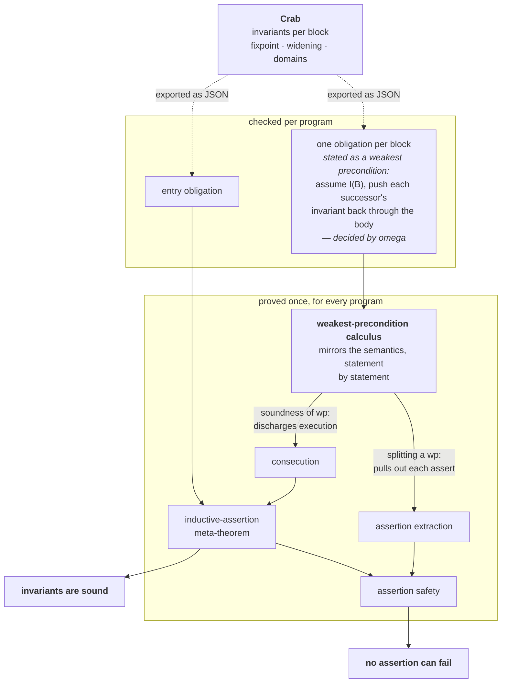

# How the proof works

*What `crabber --verify-with-lean` actually proves, and why you can believe it.*

This is the conceptual tour. It assumes you know what Crab does and does not assume you
know any Lean. Pointers into the source are given so you can go deeper where you want to;
nothing here requires following them.

---

## The claim

Run Crab on a CrabIR program and it prints an invariant for every basic block. `--verify-with-lean`
takes that output and asks Lean to prove two things about it:

1. **The invariants are genuine.** Every state the program can actually reach at a block
   satisfies the invariant Crab printed for that block.
2. **The assertions are safe.** No execution ever reaches an assertion whose condition is
   false at that point.

Both are proved against a concrete semantics of CrabIR written out in Lean, and the proof
is checked by Lean's kernel. When crabber reports

```
proved            bar : invariants sound, all assertions proved
```

that is what has been established for that CFG.

## What is *not* modelled

**Nothing about Crab itself.** No fixpoint engine, no widening, no narrowing, no abstract
domain is formalised. Only Crab's *output* is checked, per program.

This is the single most important design decision, and it has two consequences:

- The result is **indifferent to which domain produced it.** `-d int`, `-d zones`, `-d pk`,
  a domain you wrote last week — the check is the same, because it only ever looks at the
  constraints that came out.
- The job stays **bounded.** Formalising an abstract domain is a research project;
  checking a candidate invariant is a per-block arithmetic question.

The first of those is a claim about the *theorem*, and it holds. It is not a claim about
the *proof search*, and there the domain does leak in — through the shape of what it
exports rather than through its contents. Two domains can say the same thing differently:
asked about a block it knows nothing about, `-d int` exports the explicit top marker
`{"kind": "true"}` while `-d oct` and `-d pk` export a disjunct holding the nullary
constraint `{"op": "true"}`, which reads as `0 ≤ 0`. Both mean "no information"; they
reach the tactics as different terms and take different branches of the entry obligation.

That is worth knowing because it is how the one real bug in this development escaped
notice. The arithmetic branch was missing an unfolding step, so *every* `-d oct` and
`-d pk` run failed its entry obligation whatever its invariants said, while every native
domain went through the other branch and passed. A proof that works on the domain you
test with can be broken on the domain you do not — which is why the regression tests in
`CMakeLists.txt` pin an Apron-backed domain specifically, and why `oct-snf` cannot stand
in for `oct` there.

## The idea: inductive invariants

The whole thing rests on a classical observation. To show an annotation `I` holds at every
reachable state, you do not have to reason about reachability at all. It is enough to show
two local facts:

> **Initiation** — every initial state satisfies `I` at the entry block.
>
> **Consecution** — if a state satisfies `I` at block `L`, and the machine takes one step
> from `L` to `L'`, then the resulting state satisfies `I` at `L'`.

Together these say the annotation is *closed* under the machine's transitions. Reachability
is the smallest set closed under those same transitions, so it is contained in the
annotation. That is the inductive-assertion method, and it is proved once in
[`Soundness.lean`](Crabber/Soundness.lean).

**Where the leverage comes from.** Crab *computes* the invariants, which is the hard part —
iterating to a fixpoint, widening to force termination, narrowing to recover precision.
Lean only *checks* that the answer is inductive, which is local and mechanical. And an
inductive invariant is inductive no matter how it was found, so **none of the machinery
that found it needs to be trusted**. A widening bug that produced a wrong invariant
produces a failed proof; a widening bug that merely produced an *imprecise* invariant is
invisible here, because imprecise invariants are still sound.

## Turning consecution into arithmetic

Consecution as stated above quantifies over steps of a machine. That is the right shape for
the induction and a terrible shape for an automated prover. So it is converted, once, into
one self-contained obligation per block:

> **For block `B`:** assume the invariant Crab claims at `B`'s entry. Run `B`'s body. The
> result must satisfy the invariant Crab claims at the entry of *every* successor of `B`.

A block body has no control flow inside it — conditionals have already been compiled into
separate edge blocks carrying the guards, which is why the CFG being checked is the one
Crab *analysed*, not the source text. So a body is just a list of statements, and the
obligation is computed by walking that list **backwards**, pushing the requirement from the
end towards the start. Each kind of statement contributes one thing:

| statement | contributes |
|---|---|
| `x := e` | substitution — replace `x` by `e` in what follows |
| `havoc(x)` | "for every possible value of `x` …" |
| `assume(c)` | `c` becomes an assumption you may use |
| `assert(c)` | `c` becomes something you must prove |
| the boolean statements | the same three shapes, over the boolean variables |

Worked example — block `loop` of `samples/test-1.crabir`, cfg `bar`:

```
        invariant Crab claims at loop:   0 ≤ y ≤ 9
        body:                            y := y + 1
        successors claim:                1 ≤ y ≤ 10

        obligation:   0 ≤ y ≤ 9   →   1 ≤ y+1 ≤ 10
```

Which is quantifier-free linear integer arithmetic — decidable, and discharged by Lean's
`omega`. That is the shape *every* block obligation comes out in, which is what makes the
per-program half fully automatic.

## Assertions come along for free

An `assert` in CrabIR both **checks** and **filters**: execution cannot continue past a
failing assert, so downstream invariants describe only assert-passing runs. (This is
measured behaviour, not an assumption — after `havoc(x); assert(x >= 10)` Crab's next
invariant really is `x ∈ [10, +∞]`.)

Because of that, an assert's condition is something the block obligation *requires*, not
something it may assume. So the assertion obligations are already sitting inside the block
obligations. One extraction lemma, proved once in [`VC.lean`](Crabber/VC.lean), pulls them
back out.

That is why a per-program proof has exactly two parts and not three.

## How the pieces fit



The dotted arrows are the only place anything program-specific enters. Everything below
them is proved once and reused unchanged by every program.

**Where the weakest preconditions live.** They appear twice, in different roles. A block's
obligation *is* a weakest precondition — that is how "run the body and land in the
successors' invariants" becomes a formula instead of a claim about execution. And the two
lemmas that consume such a formula are what connect it to everything else: one trades a
weakest precondition plus an actual execution for a fact about the state afterwards, which
is what makes consecution follow; the other splits a body's weakest precondition at any
statement, which is what pulls each assert's obligation back out. (That first lemma is used
once more inside assertion safety, for the same reason, which the picture leaves out to
stay readable.)

This is also the part of the development that does *not* have to be trusted — see
[below](#where-the-crabir-semantics-enters) for why.

## What is proved once, and what per program

This split is the practical answer to "how expensive is this?"

**Proved once — 25 theorems, for all programs, forever.** The weakest-precondition calculus
and its soundness, the bridge from block obligations to consecution, the extraction lemma,
the inductive-assertion meta-theorem, and assertion safety. These live in
[`WP.lean`](Crabber/WP.lean), [`VC.lean`](Crabber/VC.lean) and
[`Soundness.lean`](Crabber/Soundness.lean) and are never re-derived.

**Per program — data plus two theorems.** Loading an export defines the program and the
annotation as data; then:

| | cost |
|---|---|
| two bookkeeping lemmas | true by computation |
| the entry obligation | immediate whenever Crab claims ⊤ at entry, which it does for every root CFG in `samples/` |
| **one obligation per block** | **the only real work: one `omega` call each** |
| the final result | one line, assembling the above |

That entry row is worth a second look, because it is where the one real limitation shows
up. Across every sample, the only CFGs whose entry invariant is *not* ⊤ are `inc`, `swap`,
`check` and `clamp` — and those are precisely the four that get reported `not checked`.
They are callees, and their entry invariants were derived from their call sites. See
[the last section](#what-is-in-scope-today).

### A complete example

Here is *everything* proved for one program — cfg `bar` of `samples/test-1.crabir`, a
counting loop:

```
start:  y := 0            goto loop
loop:   y := y + 1        if (y <= 9) goto loop else goto out
out:    assert(y == 10)
```

**First, the data.** This is Crab's export, transcribed. Note it has five blocks, not
three: the conditional was compiled away into two edge blocks carrying the guards, and the
check is against the CFG Crab *analysed*, not the source text.

| block | body | successors | invariant Crab inferred |
|---|---|---|---|
| `start` | `y := 0` | `loop` | ⊤ |
| `loop` | `y := y + 1` | `edge-loop-loop`, `edge-loop-out` | `0 ≤ y ≤ 9` |
| `edge-loop-loop` | `assume(y ≤ 9)` | `loop` | `1 ≤ y ≤ 10` |
| `edge-loop-out` | `assume(y ≥ 10)` | `out` | `1 ≤ y ≤ 10` |
| `out` | `assert(y = 10)` | — | `y = 10` |

This table is the **trusted** half: if it said something other than what Crab analysed, the
theorems below would be about the wrong program. That is what the round-trip check on the
JSON reader is for.

**Then, the obligations.** Six statements, each a claim about every state, each decidable
arithmetic:

```
entry             true          →  ⊤                              trivial

start             true          →  0 ≤ 0 ≤ 9                      after y := 0
loop              0 ≤ y ≤ 9     →  1 ≤ y+1 ≤ 10                   after y := y+1
edge-loop-loop    1 ≤ y ≤ 10    →  ( y ≤ 9  →  0 ≤ y ≤ 9 )
edge-loop-out     1 ≤ y ≤ 10    →  ( y ≥ 10 →  10 ≤ y ≤ 10 )
out               10 ≤ y ≤ 10   →  y = 10
```

Read the right-hand sides against the statement table from earlier. `start` and `loop` are
deterministic, so their assignment is pure substitution and nothing is quantified. The two
edge blocks each gain exactly one arrow, from their `assume`. And `out` has no successors
at all, so there is no invariant to re-establish — everything left is the assert's own
obligation, which is how "the assertion is safe" ends up being checked by the same
mechanism as everything else.

**That is the entire per-program artifact.** Five block obligations because there are five
blocks, plus the entry one, plus one line assembling them into

> the invariants Crab inferred for `bar` are genuine invariants of the program, and its
> assertion can never fail.

No induction, no reasoning about execution or reachability, nothing about `Step` — all of
that was discharged once, in the lemmas above, and is reused here unchanged.

**With booleans it is the same picture.** A block of `samples/test-bool-1.crabir` with
seven boolean statements in it reduces to a single line of integer arithmetic:

```
10 ≤ x ≤ 10  →  x = 10  ∧  0 ≤ x  ∧  (x = 10 ∨ x ≠ 10 ∨ x < 0)  ∧  (x = 10 → 0 ≤ x)  ∧  …
```

Every boolean has disappeared. That trailing implication, for instance, is the statement
`b5 := b0 xor not(b0 and b1)` being required to hold: work the truth table and it comes out
as `b0 → b1`, which is `x = 10 → 0 ≤ x`. Booleans are reasoned about as booleans and never
encoded as 0/1 integers, so the prover only ever sees arithmetic.

So the per-program cost is **linear in the number of blocks** and nothing else. Three blocks
and thirty run the identical script, which is why it can be generated rather than written.
Typical end-to-end time for a sample is a few seconds.

## Where the CrabIR semantics enters

There are two distinct things here, and they behave very differently.

**The transition semantics** — what a statement does to a state, what one step of the
machine is, which configurations are reachable — is defined in
[`Semantics.lean`](Crabber/Semantics.lean) and is **consumed at exactly four places**, all
of them program-independent. After those four lemmas, nothing downstream mentions the
machine at all. No per-program artifact ever reasons about execution or reachability; it
only ever does arithmetic.

**The meaning of expressions and constraints** — what `2·x + y ≤ 9` says about a state — is
used in *every* program's proof, because that is precisely what turns Crab's exported
constraints from data into arithmetic that `omega` can decide.

**The joint that makes this safe.** The weakest-precondition calculus is defined to mirror
the semantics statement by statement, and the lemma tying the two together is itself
checked by the kernel. Write the wrong rule for a statement and that lemma stops compiling.
So the calculus — the part with all the moving pieces — does not have to be trusted at all:
a bug in it can only fail to find a proof, never produce a wrong one.

## What is trusted

The point of the exercise is that this list is short and explicit.

**Trusted — a bug here could certify a false invariant:**

| | |
|---|---|
| The Lean model of CrabIR's semantics | The substantive one. It *is* the claim about what a CrabIR program means, and nothing can prove it right. Mitigated by probing the real analyser and matching its measured behaviour. |
| The exporter | Crab's rendering of an abstract state as linear constraints, and crabber's JSON around it. |
| The JSON reader | Mitigated: it writes back out what it read and compares against the input, so a dropped statement or misread coefficient is reported rather than believed. |
| crabber's own report | "proved" only says crabber ran Lean and Lean agreed. To rely on it, run `lake build` in `lean/` yourself. |

**Not trusted — proved, or checked by the kernel:** the weakest-precondition calculus, the
block obligations, the meta-theorems, and every per-program proof. Tactics search for
proofs; the kernel checks them. A tactic can fail; it cannot lie.

## Reading a negative result

`could not verify` is a statement about the **proof attempt**, not about Crab. The check is
sound but incomplete. It can mean:

- the invariant genuinely is not inductive — the interesting case;
- the arithmetic was beyond the prover, for instance because it is non-linear;
- the program contains an assertion Crab itself could not establish, which is normal for
  the samples marked `EXPECT_EQ(false, …)`.

When the arithmetic is what ran out, the report shows the assignment it could not rule out,
restated in your own variable names:

```
could not verify  octagons : omega could not prove the goal
  cannot rule out : 101 ≤ y ≤ 200
```

That is **not** a counterexample — the state may well be unreachable. It says where the
reasoning stopped, which is usually the quickest way to see whether a fact is missing or an
invariant is genuinely too weak.

To dig in, keep the intermediate files:

```bash
crabber samples/test-2.crabir --verify-with-lean --lean-keep-temp --lean-show-output
```

This prints the exported JSON, the generated Lean file, and the command that re-runs it.
That file is everything Lean was given.

## What is in scope today

**Modelled:** the integer core (`assign`, `havoc` of an integer, `assume`, `assert`) and the
whole boolean fragment. Integers are unbounded mathematical integers, which is not an
idealisation: crabber's parser builds Crab's `MATH_INT_TYPE` and nothing else, and every domain
it runs interprets values over ℤ. (Crab can still express fixed-width integers; crabber no
longer asks it to.)

**Not modelled:** arithmetic `binop` and `select`, `bool_to_int`, `havoc` of a boolean,
procedure calls, and the array and reference families. A CFG using one of these is reported
`not attempted`, with the construct named.

Nothing is ever silently skipped. Dropping a statement would weaken every obligation in its
block, so an unmodelled construct fails the read and says so.

**Only the roots of the call graph are checked.** A callee's invariants are not properties
of the callee: Crab's top-down interprocedural analysis derives them from the call sites, so
it may infer `a >= 5` at a function's entry only because of how its caller happens to call
it. The theorem Lean proves quantifies over every initial state, which is a strictly
stronger claim than Crab made — so checking a callee in isolation would ask a question Crab
never answered. Called CFGs are reported `not checked` rather than passed over.

## Try it

```bash
crabber samples/test-1.crabir      -d int --verify-with-lean   # one proved, one refuted
crabber samples/test-bool-1.crabir -d int --verify-with-lean   # the boolean fragment
crabber samples/test-3.crabir      -d int --verify-with-lean   # nested loops
```

Enable it at configure time with `cmake -DLAKE_EXECUTABLE=$(which lake) ../`.

To check the proofs yourself rather than taking crabber's word for it, run `lake build` in
[`lean/`](.) — that elaborates the committed sample proofs and puts them through the kernel.

---

### Going deeper

The Lean sources are written to be read, with the reasoning behind each decision in the
module headers.

| | |
|---|---|
| [`Crabber/Syntax.lean`](Crabber/Syntax.lean) | CrabIR programs as data; what is modelled and what is deferred |
| [`Crabber/State.lean`](Crabber/State.lean) | states, and the meaning of expressions in one |
| [`Crabber/Semantics.lean`](Crabber/Semantics.lean) | what a program *does* — the trusted core |
| [`Crabber/WP.lean`](Crabber/WP.lean) | the weakest-precondition calculus and its soundness |
| [`Crabber/VC.lean`](Crabber/VC.lean) | the per-block obligation, and the bridge to consecution |
| [`Crabber/Soundness.lean`](Crabber/Soundness.lean) | the two meta-theorems |
| [`Crabber/Samples/Walkthrough.lean`](Crabber/Samples/Walkthrough.lean) | the automation unrolled, one tactic at a time, for reading in an editor |
